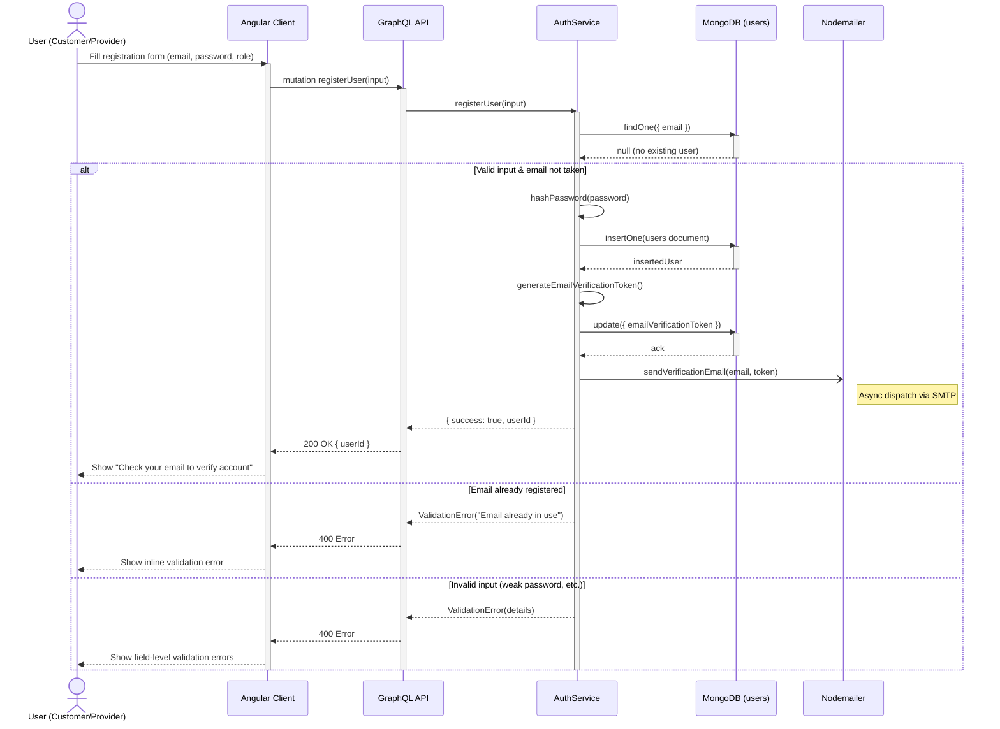
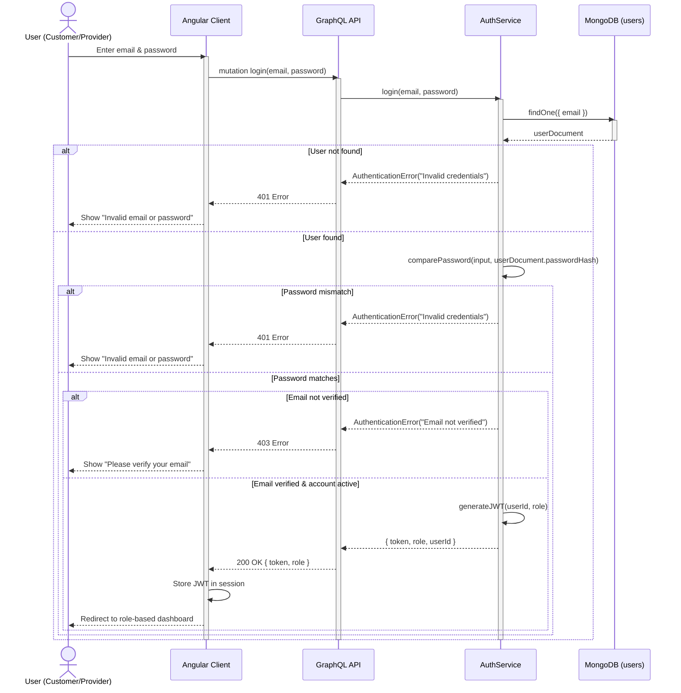
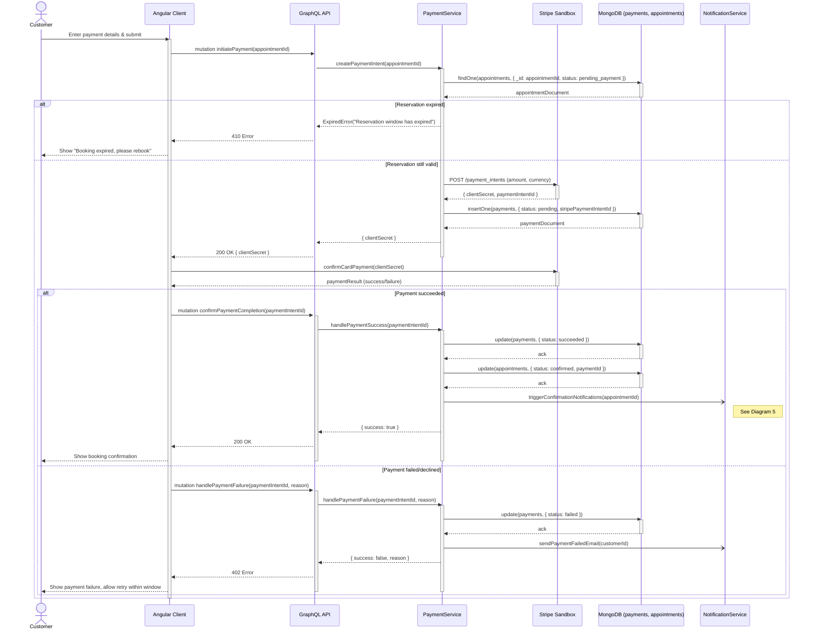
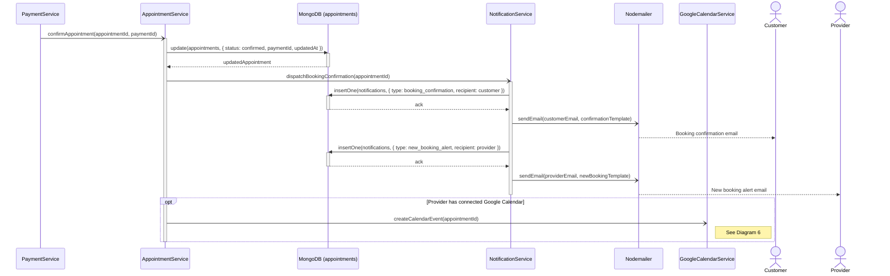
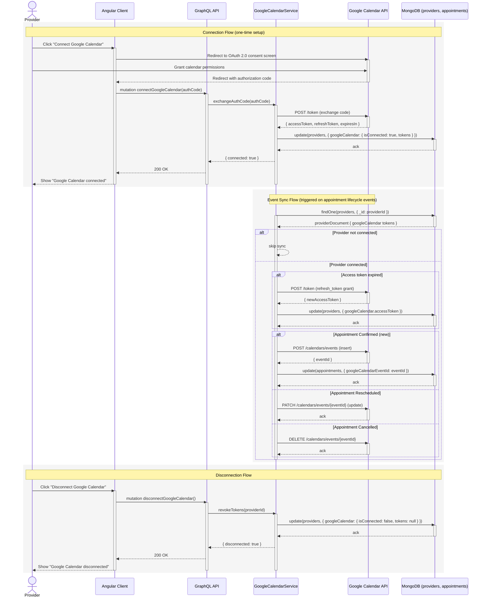
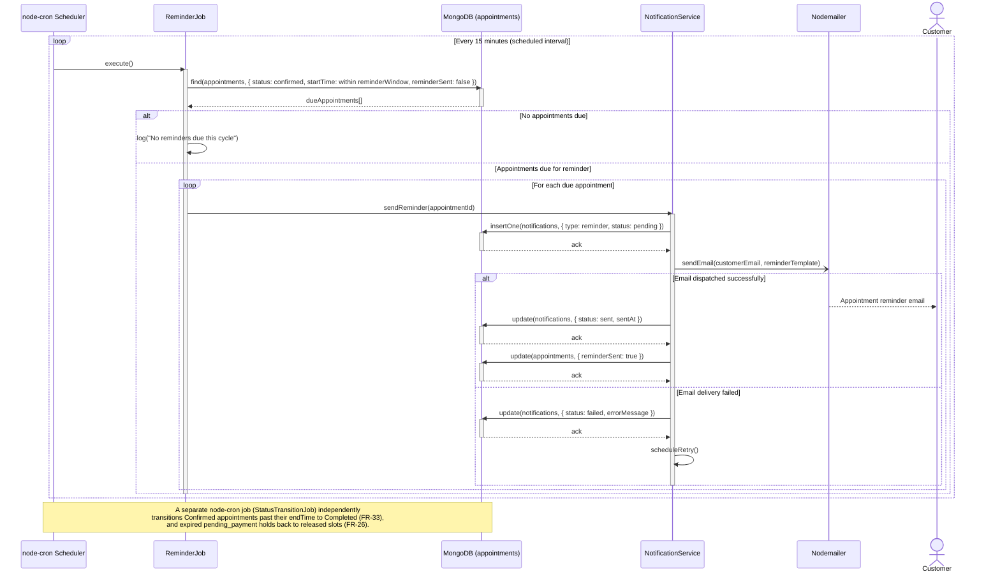
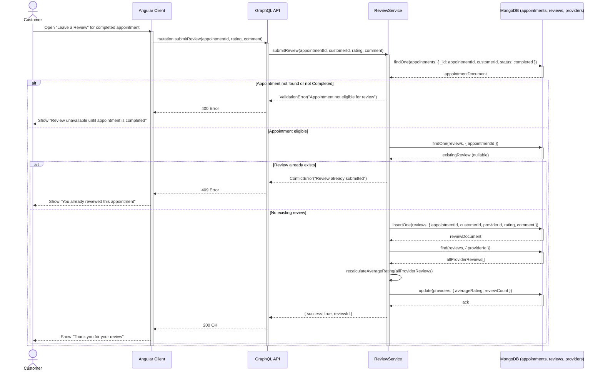

# Sequence Diagrams

**Project:** Bookify – Smart Appointment & Business Management Platform
**Document Version:** 1.0
**Date:** June 30, 2026
**Based On:** Bookify SRS v1.0, Software Analysis v1.0, System Design v1.0
**Prepared By:** Software Architecture & Business Analysis Team

All diagrams use Mermaid `sequenceDiagram` syntax with explicit `activate`/`deactivate` lifelines, `alt`/`opt`/`loop` combined fragments, and synchronous/asynchronous message conventions consistent with UML 2.x notation. Participants and flows are kept consistent with the SRS functional requirements, use case specifications, and database/class design previously defined.

---

## 1. User Registration

**Covers:** FR-01, FR-02, FR-03 (UC-01)



---

## 2. User Login

**Covers:** FR-04 (UC-02)



---

## 3. Book Appointment

**Covers:** FR-23, FR-24, FR-26, FR-27 (UC-09)

```mermaid
sequenceDiagram
    actor C as Customer
    participant FE as Angular Client
    participant API as GraphQL API
    participant ASVC as AppointmentService
    participant DB as MongoDB (appointments)
    participant WH as WorkingHoursService

    C->>FE: Select Service + Provider
    activate FE
    FE->>API: query availableSlots(providerId, serviceId, date)
    activate API
    API->>WH: generateAvailableSlots(provider, service, date)
    activate WH
    WH->>DB: find existing appointments for provider/date
    activate DB
    DB-->>WH: bookedSlots[]
    deactivate DB
    WH-->>API: availableSlots[]
    deactivate WH
    API-->>FE: availableSlots[]
    FE-->>C: Display available time slots
    deactivate API

    C->>FE: Select slot & confirm booking request
    FE->>API: mutation requestBooking(providerId, serviceId, slot)
    activate API
    API->>ASVC: reserveSlot(providerId, serviceId, slot, customerId)
    activate ASVC

    ASVC->>DB: findOneAndUpdate (atomic check-and-insert on {providerId, startTime, endTime})
    activate DB
    alt Slot already held/booked
        DB-->>ASVC: null (conflict)
        deactivate DB
        ASVC-->>API: ConflictError("Slot no longer available")
        API-->>FE: 409 Error
        FE-->>C: Show "Slot unavailable, please choose another"
    else Slot successfully locked
        DB-->>ASVC: appointmentDocument (status: pending_payment)
        deactivate DB
        ASVC->>ASVC: setReservationExpiry(+10 minutes)
        ASVC->>DB: update reservationExpiresAt
        activate DB
        DB-->>ASVC: ack
        deactivate DB
        ASVC-->>API: { appointmentId, reservationExpiresAt }
        API-->>FE: 200 OK { appointmentId, expiresAt }
        FE-->>C: Redirect to payment step (see Diagram 4)
    end
    deactivate ASVC
    deactivate API
    deactivate FE
```

---

## 4. Stripe Payment Workflow

**Covers:** FR-25, FR-34–FR-38 (UC-10)



---

## 5. Appointment Confirmation

**Covers:** FR-25, FR-39 (UC-09 main flow, step 6)

*Triggered immediately following successful payment in Diagram 4. Shown here as an independent, detailed flow for clarity.*



---

## 6. Google Calendar Synchronization

**Covers:** FR-50, FR-51, FR-52 (UC-18)



---

## 7. Reminder Scheduler

**Covers:** FR-40, FR-33 (background job orchestration via node-cron; NFR-09)



---

## 8. Review Submission

**Covers:** FR-43, FR-44, FR-45 (UC-15)



---

*End of Document*
