# Software Analysis Documentation

**Project:** Bookify – Smart Appointment & Business Management Platform
**Document Version:** 1.0
**Date:** June 30, 2026
**Based On:** Bookify SRS v1.0
**Prepared By:** Software Architecture & Business Analysis Team

---

## 1. User Stories

User stories are grouped by functional area and traced back to their corresponding SRS Functional Requirement IDs for consistency.

### 1.1 Authentication & Account Management

**US-01** (FR-01, FR-02)
As a new user,
I want to register as either a Provider or a Customer,
So that I can access the features relevant to my role.

**US-02** (FR-03)
As a newly registered user,
I want to verify my email address via a confirmation link,
So that I can activate full access to my account.

**US-03** (FR-04)
As a registered user,
I want to log in with my email and password,
So that I can securely access my account.

**US-04** (FR-05)
As a user who forgot my password,
I want to reset it via a secure email link,
So that I can regain access to my account.

**US-05** (FR-06)
As a Provider or Customer,
I want to update my profile information and photo,
So that my account details stay accurate and current.

**US-06** (FR-07)
As a user,
I want to deactivate my own account,
So that I can stop using the platform when I no longer need it.

**US-07** (FR-08)
As a system,
I want to restrict Provider-only and Customer-only actions by role,
So that users cannot access functionality outside their permissions.

### 1.2 Provider Profile & Service Management

**US-08** (FR-09)
As a Provider,
I want to create and edit my business profile,
So that Customers can learn about my business.

**US-09** (FR-10)
As a Provider,
I want to upload business and profile images,
So that my profile looks professional and trustworthy.

**US-10** (FR-11)
As a Provider,
I want to create a new service with a name, price, and duration,
So that Customers can book it.

**US-11** (FR-12)
As a Provider,
I want to edit or deactivate an existing service,
So that I can keep my offerings up to date.

**US-12** (FR-13)
As a Provider,
I want the system to prevent me from deleting a service with active bookings,
So that I don't accidentally disrupt confirmed appointments.

### 1.3 Working Hours & Availability

**US-13** (FR-14)
As a Provider,
I want to define my recurring weekly working hours,
So that customers only see times when I'm actually available.

**US-14** (FR-15)
As a Provider,
I want to set date-specific exceptions like holidays or time off,
So that I'm not booked when I'm unavailable.

**US-15** (FR-16, FR-17)
As a Customer,
I want to see only real, currently bookable time slots,
So that I don't attempt to book a time that isn't actually available.

**US-16** (FR-18)
As a Provider,
I want to set minimum lead time and maximum advance booking windows,
So that I can control how far in advance customers can book.

**US-17** (FR-19)
As a Provider,
I want to configure a buffer time between appointments,
So that I have time to prepare between bookings.

### 1.4 Service Discovery

**US-18** (FR-20)
As a Customer,
I want to search and browse providers by category and location,
So that I can find a service that fits my needs.

**US-19** (FR-21)
As a Customer,
I want to view a provider's profile, services, and reviews,
So that I can decide whether to book with them.

**US-20** (FR-22)
As a Customer,
I want to see real-time slot availability,
So that I can choose a time that is actually open.

### 1.5 Appointment Booking & Lifecycle

**US-21** (FR-23)
As a Customer,
I want to select a service, provider, and time slot,
So that I can request an appointment.

**US-22** (FR-24, FR-26)
As a Customer,
I want my selected slot to be temporarily held while I complete payment,
So that someone else can't book it before I finish checkout.

**US-23** (FR-25)
As a system,
I want to confirm an appointment only after successful payment,
So that providers are guaranteed payment for confirmed bookings.

**US-24** (FR-27)
As a system,
I want to prevent two customers from booking the same slot simultaneously,
So that double-booking never occurs.

**US-25** (FR-29)
As a Customer,
I want to cancel my appointment,
So that I can free up my schedule if my plans change.

**US-26** (FR-30)
As a Customer,
I want to reschedule my appointment to a new available slot,
So that I can adjust the time without losing my booking entirely.

**US-27** (FR-31)
As a Provider,
I want to cancel an appointment when necessary,
So that I can handle emergencies while keeping the customer informed and refunded.

**US-28** (FR-32)
As a Provider,
I want to mark a past appointment as Completed or No-show,
So that my records and customer history stay accurate.

**US-29** (FR-33)
As a system,
I want to automatically mark past confirmed appointments as Completed,
So that providers don't have to update every appointment manually.

### 1.6 Payments

**US-30** (FR-34, FR-35)
As a Customer,
I want to pay for my appointment online via Stripe,
So that I can secure my booking immediately.

**US-31** (FR-36)
As a Customer,
I want to receive a refund automatically when eligible after a cancellation,
So that I'm not charged for a service I didn't receive.

**US-32** (FR-37)
As a Customer,
I want to be notified by email about payment success, failure, or refund,
So that I always know the financial status of my booking.

**US-33** (FR-38)
As a Customer,
I want assurance that my card details are never stored by Bookify,
So that I can trust the platform with my payment information.

### 1.7 Notifications & Reminders

**US-34** (FR-39)
As a Customer,
I want to receive a confirmation email after booking,
So that I have proof and details of my appointment.

**US-35** (FR-39)
As a Provider,
I want to receive a notification when a new booking is made,
So that I'm immediately aware of new appointments.

**US-36** (FR-40)
As a Customer,
I want to receive a reminder email before my appointment,
So that I don't forget to attend.

**US-37** (FR-41)
As a Customer or Provider,
I want to be notified when an appointment is cancelled or rescheduled,
So that I'm always aware of changes to my schedule.

**US-38** (FR-42)
As a Customer,
I want to receive a request to review my completed appointment,
So that I can easily share feedback about my experience.

### 1.8 Reviews & Ratings

**US-39** (FR-43)
As a Customer,
I want to leave a star rating and written review after a completed appointment,
So that I can share my experience with other customers.

**US-40** (FR-44)
As a system,
I want to prevent multiple reviews per appointment,
So that ratings remain fair and accurate.

**US-41** (FR-45)
As a Provider,
I want to view all reviews and my average rating,
So that I can understand customer satisfaction with my business.

**US-42** (FR-46)
As a Provider,
I want to reply publicly to a customer review,
So that I can respond to feedback professionally.

### 1.9 Provider Dashboard

**US-43** (FR-47)
As a Provider,
I want to view a dashboard summarizing appointments, revenue, and ratings,
So that I can track my business performance at a glance.

**US-44** (FR-48)
As a Provider,
I want to filter dashboard data by date range,
So that I can analyze performance over specific periods.

**US-45** (FR-49)
As a Provider,
I want to view a calendar/list of upcoming and past appointments,
So that I can plan my schedule effectively.

### 1.10 Google Calendar Integration

**US-46** (FR-50)
As a Provider,
I want to connect my Google account to Bookify,
So that my appointments sync automatically with my personal calendar.

**US-47** (FR-51)
As a Provider,
I want my Google Calendar to update automatically when appointments change,
So that my calendar always reflects my real schedule.

**US-48** (FR-52)
As a Provider,
I want to disconnect my Google Calendar integration,
So that I can stop syncing whenever I choose.

---

## 2. Use Case List

| UC ID | Use Case Name | Primary Actor(s) | Related FRs |
|---|---|---|---|
| UC-01 | Register Account | Customer, Provider | FR-01, FR-02, FR-03 |
| UC-02 | Log In | Customer, Provider | FR-04 |
| UC-03 | Reset Password | Customer, Provider | FR-05 |
| UC-04 | Manage Profile | Customer, Provider | FR-06, FR-07 |
| UC-05 | Manage Business Profile | Provider | FR-09, FR-10 |
| UC-06 | Manage Services | Provider | FR-11, FR-12, FR-13 |
| UC-07 | Manage Working Hours & Availability | Provider | FR-14–FR-19 |
| UC-08 | Search and Browse Providers/Services | Customer | FR-20, FR-21, FR-22 |
| UC-09 | Book Appointment | Customer | FR-23–FR-27 |
| UC-10 | Make Payment | Customer | FR-34–FR-38 |
| UC-11 | Cancel Appointment | Customer, Provider | FR-29, FR-31, BR-03, BR-04 |
| UC-12 | Reschedule Appointment | Customer | FR-30 |
| UC-13 | Manage Appointment Status (Complete/No-show) | Provider | FR-32, FR-33 |
| UC-14 | Receive Notifications & Reminders | Customer, Provider | FR-39–FR-42 |
| UC-15 | Submit Review | Customer | FR-43, FR-44 |
| UC-16 | View and Respond to Reviews | Provider | FR-45, FR-46 |
| UC-17 | View Dashboard & Reports | Provider | FR-47, FR-48, FR-49 |
| UC-18 | Sync with Google Calendar | Provider | FR-50, FR-51, FR-52 |

---

## 3. Fully Detailed Use Case Specifications

This section provides full specifications for the major, high-complexity use cases. Simpler CRUD-style use cases (e.g., UC-01 through UC-04) follow standard flows and are summarized in Section 2; the following use cases represent the system's core business value and highest workflow complexity.

---

### UC-06: Manage Services

**Description:** Allows a Provider to create, edit, and deactivate the services offered through their Bookify profile.

**Actors:** Provider (primary)

**Preconditions:**
- The Provider is authenticated and has a complete business profile.

**Main Flow:**
1. The Provider navigates to the "Services" section of their portal.
2. The Provider selects "Add New Service."
3. The Provider enters service name, description, price, duration, and category.
4. The Provider submits the form.
5. The system validates the input and saves the new Service.
6. The system displays the newly created Service in the Provider's service list, immediately available for Customer booking.

**Alternative Flow:**
- **A1 – Edit Existing Service:** At step 2, the Provider selects an existing Service to edit instead of creating a new one. The system pre-fills the form with current values; the Provider updates fields and submits; the system saves the changes.
- **A2 – Deactivate Service:** The Provider selects "Deactivate" on an existing Service with no future bookings. The system marks the Service as inactive; it is hidden from Customer search but retained in historical records.

**Exception Flow:**
- **E1 – Invalid Input:** If required fields are missing or invalid (e.g., negative price, zero duration), the system displays a validation error and does not save the Service.
- **E2 – Deletion Blocked:** If the Provider attempts to delete/deactivate a Service with active future appointments, the system blocks the action and displays a message instructing the Provider to cancel or reassign those appointments first (per BR-07).

**Postconditions:**
- The Service is created, updated, or deactivated as requested, and the Customer-facing catalog reflects the change in real time.

---

### UC-07: Manage Working Hours & Availability

**Description:** Allows a Provider to configure recurring working hours, exceptions, booking windows, and buffer times, which collectively determine the bookable slots shown to Customers.

**Actors:** Provider (primary)

**Preconditions:**
- The Provider is authenticated and has at least one active Service.

**Main Flow:**
1. The Provider navigates to "Working Hours" settings.
2. The Provider sets start and end times for each working day of the week.
3. The Provider optionally configures minimum lead time, maximum advance booking window, and buffer time between appointments.
4. The Provider saves the configuration.
5. The system recalculates available booking slots for all active Services based on the new configuration.

**Alternative Flow:**
- **A1 – Add Exception Date:** The Provider adds a specific date (e.g., a holiday) marked as fully or partially unavailable. The system overrides recurring hours for that date and removes affected slots from Customer visibility.
- **A2 – Mark a Day as Fully Unavailable:** The Provider toggles an entire weekday off; the system excludes that day from slot generation entirely.

**Exception Flow:**
- **E1 – Invalid Time Range:** If the Provider sets an end time earlier than the start time, the system rejects the input with a validation message.
- **E2 – Conflicting Existing Bookings:** If a new exception or reduced working-hours change would conflict with already-Confirmed appointments, the system warns the Provider and requires explicit confirmation before applying the change (the existing Confirmed appointments are not automatically cancelled).

**Postconditions:**
- The Provider's availability rules are updated, and slot generation for future bookings reflects the new working hours, exceptions, lead time, and buffer settings.

---

### UC-09: Book Appointment

**Description:** Allows a Customer to select a Service and an available time slot from a Provider and initiate the booking process, which is finalized through payment (UC-10).

**Actors:** Customer (primary), Provider (secondary – receives notification)

**Preconditions:**
- The Customer is authenticated.
- The selected Provider has at least one active Service with available slots.

**Main Flow:**
1. The Customer browses to a Provider's profile and selects a Service.
2. The system displays available time slots based on the Provider's working hours, existing bookings, and exceptions.
3. The Customer selects an available slot and confirms the booking request.
4. The system temporarily reserves the slot (holds it from other Customers) for a configurable reservation window.
5. The system redirects the Customer to the payment step (UC-10).
6. Upon successful payment, the system confirms the appointment, updates its status to **Confirmed**, and triggers confirmation notifications to both Customer and Provider (UC-14).

**Alternative Flow:**
- **A1 – Slot Becomes Unavailable Before Selection Confirmed:** If, between viewing and selecting, another Customer books the same slot, the system informs the Customer the slot is no longer available and refreshes the available slot list.

**Exception Flow:**
- **E1 – Reservation Window Expires:** If the Customer does not complete payment within the reservation hold window, the system automatically releases the slot back to availability and notifies the Customer that the booking attempt expired (FR-26).
- **E2 – Payment Failure:** If payment fails during UC-10, the system releases the held slot and the appointment remains unconfirmed (see UC-10, E1).
- **E3 – Concurrent Booking Conflict:** If a race condition is detected at the atomic slot-locking level, the system rejects the later request and instructs that Customer to select a different slot (FR-27, NFR-08).

**Postconditions:**
- On success: An appointment exists with status Confirmed, linked to a successful payment transaction; both parties are notified; the slot is permanently removed from availability.
- On failure/expiry: No appointment is created, and the slot returns to the available pool.

---

### UC-10: Make Payment

**Description:** Allows a Customer to pay for a temporarily reserved appointment slot via Stripe Sandbox, finalizing the booking.

**Actors:** Customer (primary), Stripe Sandbox (external system)

**Preconditions:**
- A slot has been temporarily reserved for the Customer as part of UC-09.
- The reservation window has not yet expired.

**Main Flow:**
1. The system presents the Customer with a payment form showing the Service price and appointment details.
2. The Customer enters payment details and submits.
3. The system creates a payment intent via the Stripe Sandbox API.
4. Stripe processes the payment and returns a success status.
5. The system records the transaction (amount, currency, status, Stripe reference) and marks the appointment as Confirmed.
6. The system triggers confirmation notifications (UC-14).

**Alternative Flow:**
- **A1 – Saved Payment Method:** If the Customer has previously used Stripe and consented to save a payment method, the Customer may select it instead of re-entering card details.

**Exception Flow:**
- **E1 – Payment Declined:** If Stripe returns a failure status (e.g., card declined), the system displays an error to the Customer, does not confirm the appointment, and allows the Customer to retry within the remaining reservation window.
- **E2 – Stripe API Unavailable:** If the Stripe Sandbox API is unreachable, the system displays a service-unavailable message, preserves the slot hold if time remains, and logs the failure for monitoring.
- **E3 – Reservation Expired Mid-Payment:** If the reservation window expires while payment is in progress, the system rejects the late confirmation, releases the slot, and informs the Customer the booking attempt has expired.

**Postconditions:**
- On success: A payment transaction record is created and linked to a Confirmed appointment.
- On failure: No appointment is confirmed; the slot is released if the hold window has elapsed; the Customer is informed of the failure reason.

---

### UC-11: Cancel Appointment

**Description:** Allows a Customer or Provider to cancel a Confirmed appointment, subject to the platform's cancellation and refund business rules.

**Actors:** Customer (primary), Provider (primary, alternate path)

**Preconditions:**
- An appointment exists with status Confirmed.

**Main Flow (Customer-Initiated):**
1. The Customer navigates to "My Appointments" and selects an upcoming Confirmed appointment.
2. The Customer selects "Cancel Appointment."
3. The system evaluates the cancellation timing against the Provider's configured cancellation cutoff window (BR-03).
4. If within the refund-eligible window, the system processes a refund via Stripe Sandbox; if not, no refund is issued (unless the Provider manually overrides).
5. The system updates the appointment status to **Cancelled by Customer**.
6. The system releases the time slot back to availability and notifies the Provider (UC-14).

**Alternative Flow:**
- **A1 – Provider-Initiated Cancellation:** The Provider selects "Cancel Appointment" from their appointment list. The system always processes a full refund (BR-04), sets status to **Cancelled by Provider**, releases the slot, and notifies the Customer.
- **A2 – Provider Override of Refund Policy:** During a Customer-initiated cancellation outside the refund window, the Provider may manually approve a refund exception; the system then processes the refund accordingly.

**Exception Flow:**
- **E1 – Refund Processing Failure:** If the Stripe refund request fails, the system logs the failure, keeps the appointment in a "Cancellation Pending – Refund Issue" sub-state, and flags it for manual reconciliation rather than silently failing.
- **E2 – Appointment Already Completed:** If the Customer attempts to cancel an appointment that has already transitioned to Completed, the system rejects the action with an explanatory message.

**Postconditions:**
- The appointment status is updated to a Cancelled state, the slot is released, refund processing (if applicable) is initiated, and both parties are notified.

---

### UC-12: Reschedule Appointment

**Description:** Allows a Customer to move a Confirmed appointment to a different available slot with the same Provider and Service, subject to the Provider's rescheduling policy.

**Actors:** Customer (primary)

**Preconditions:**
- An appointment exists with status Confirmed.
- The reschedule request is made within any Provider-defined rescheduling cutoff window.

**Main Flow:**
1. The Customer selects "Reschedule" on an upcoming Confirmed appointment.
2. The system displays currently available slots for the same Provider and Service.
3. The Customer selects a new slot and confirms.
4. The system validates the new slot is still available and atomically reserves it.
5. The system releases the original slot, updates the appointment with the new date/time, and retains the existing payment/transaction record (no new payment required, assuming no price difference).
6. The system notifies both Customer and Provider of the change (UC-14) and updates the synced Google Calendar event if connected (UC-18).

**Alternative Flow:**
- **A1 – No Suitable Slots Available:** If no alternative slots exist within the Customer's desired range, the Customer may cancel instead (UC-11) and rebook separately.

**Exception Flow:**
- **E1 – Selected New Slot Becomes Unavailable:** If another Customer books the desired new slot before this request completes, the system rejects the reschedule and prompts the Customer to choose a different slot.
- **E2 – Outside Rescheduling Window:** If the request falls outside the Provider's allowed rescheduling window, the system rejects the request and informs the Customer of the applicable policy.

**Postconditions:**
- The appointment reflects the new date/time with status remaining Confirmed; the original slot is released; the Google Calendar event (if applicable) is updated.

---

### UC-15: Submit Review

**Description:** Allows a Customer to submit a star rating and optional written review for a Provider after a completed appointment.

**Actors:** Customer (primary)

**Preconditions:**
- The appointment associated with the Provider has status Completed.
- The Customer has not previously submitted a review for this appointment.

**Main Flow:**
1. The Customer receives a post-appointment review request notification (UC-14) or navigates directly to a Completed appointment.
2. The Customer selects "Leave a Review."
3. The Customer selects a star rating (1–5) and optionally enters written feedback.
4. The Customer submits the review.
5. The system validates that no prior review exists for this appointment, saves the review, and recalculates the Provider's average rating.
6. The system displays the review on the Provider's public profile.

**Alternative Flow:**
- **A1 – Rating Only, No Written Text:** The Customer submits a star rating without written comments; the system accepts the submission as valid.

**Exception Flow:**
- **E1 – Duplicate Review Attempt:** If the Customer attempts to submit a second review for the same appointment, the system rejects the request and displays a message indicating a review has already been submitted (FR-44, BR-05).
- **E2 – Appointment Not Yet Completed:** If the Customer attempts to access the review form for an appointment not in Completed status, the system denies access to the review form.

**Postconditions:**
- A review record is created and linked to the appointment and Provider; the Provider's average rating is updated and reflected on their public profile.

---

### UC-17: View Dashboard & Reports

**Description:** Allows a Provider to view a summary dashboard of business performance, including appointments, revenue, and ratings, filterable by date range.

**Actors:** Provider (primary)

**Preconditions:**
- The Provider is authenticated and has at least one historical or upcoming appointment.

**Main Flow:**
1. The Provider navigates to the "Dashboard" section.
2. The system aggregates and displays: total appointments by status, upcoming appointments, total revenue, and average rating.
3. The Provider optionally selects a custom date range filter.
4. The system recalculates and displays the filtered metrics.

**Alternative Flow:**
- **A1 – No Data Available:** If the Provider has no appointments yet, the system displays an empty-state dashboard with guidance on creating their first Service and sharing their profile.

**Exception Flow:**
- **E1 – Data Aggregation Failure:** If the system is unable to retrieve dashboard metrics (e.g., database timeout), it displays a retry option and logs the error rather than showing incorrect data.

**Postconditions:**
- The Provider views accurate, up-to-date (or appropriately filtered) performance metrics for their business.

---

### UC-18: Sync with Google Calendar

**Description:** Allows a Provider to connect their Google account so that appointment lifecycle events are automatically reflected in their personal Google Calendar.

**Actors:** Provider (primary), Google Calendar API (external system)

**Preconditions:**
- The Provider is authenticated on Bookify.

**Main Flow:**
1. The Provider navigates to "Integrations" and selects "Connect Google Calendar."
2. The system redirects the Provider to Google's OAuth 2.0 consent screen.
3. The Provider grants calendar access permissions.
4. Google redirects back to Bookify with an authorization code; the system exchanges it for access/refresh tokens and stores them securely.
5. The system confirms the connection is active.
6. For all subsequent appointment Confirmed, Rescheduled, or Cancelled events, the system automatically creates, updates, or deletes the corresponding Google Calendar event.

**Alternative Flow:**
- **A1 – Disconnect Integration:** The Provider selects "Disconnect" in Integrations settings; the system revokes stored tokens and stops further calendar synchronization. Existing synced events are not retroactively deleted from Google Calendar.

**Exception Flow:**
- **E1 – OAuth Consent Denied:** If the Provider declines permission on Google's consent screen, the system returns to the Integrations page with a message that the connection was not completed.
- **E2 – Token Expired/Revoked Externally:** If a stored refresh token becomes invalid (e.g., revoked from the Google account side), the system detects the failure on next sync attempt, marks the integration as disconnected, and prompts the Provider to reconnect.
- **E3 – Google API Unavailable:** If the Google Calendar API is temporarily unreachable during an event sync, the system logs the failure and retries per its background job retry policy without blocking the underlying appointment operation.

**Postconditions:**
- On successful connection: The Provider's Google Calendar reflects current and future Bookify appointments automatically.
- On disconnection: No further automatic sync occurs; the Bookify appointment data remains unaffected.

---

## 4. Use Case Diagram (Mermaid Syntax)

```mermaid
graph TD
    Customer((Customer))
    Provider((Provider))

    UC01[Register Account]
    UC02[Log In]
    UC03[Reset Password]
    UC04[Manage Profile]
    UC05[Manage Business Profile]
    UC06[Manage Services]
    UC07[Manage Working Hours and Availability]
    UC08[Search and Browse Providers and Services]
    UC09[Book Appointment]
    UC10[Make Payment]
    UC11[Cancel Appointment]
    UC12[Reschedule Appointment]
    UC13[Manage Appointment Status]
    UC14[Receive Notifications and Reminders]
    UC15[Submit Review]
    UC16[View and Respond to Reviews]
    UC17[View Dashboard and Reports]
    UC18[Sync with Google Calendar]

    Customer --> UC01
    Customer --> UC02
    Customer --> UC03
    Customer --> UC04
    Customer --> UC08
    Customer --> UC09
    Customer --> UC10
    Customer --> UC11
    Customer --> UC12
    Customer --> UC14
    Customer --> UC15

    Provider --> UC01
    Provider --> UC02
    Provider --> UC03
    Provider --> UC04
    Provider --> UC05
    Provider --> UC06
    Provider --> UC07
    Provider --> UC11
    Provider --> UC13
    Provider --> UC14
    Provider --> UC16
    Provider --> UC17
    Provider --> UC18

    UC09 -.include.-> UC10
    UC11 -.include.-> UC14
    UC09 -.include.-> UC14
    UC12 -.include.-> UC14
    UC15 -.include.-> UC16
    UC09 -.extend.-> UC18
    UC12 -.extend.-> UC18
    UC11 -.extend.-> UC18
```

---

*End of Document*
