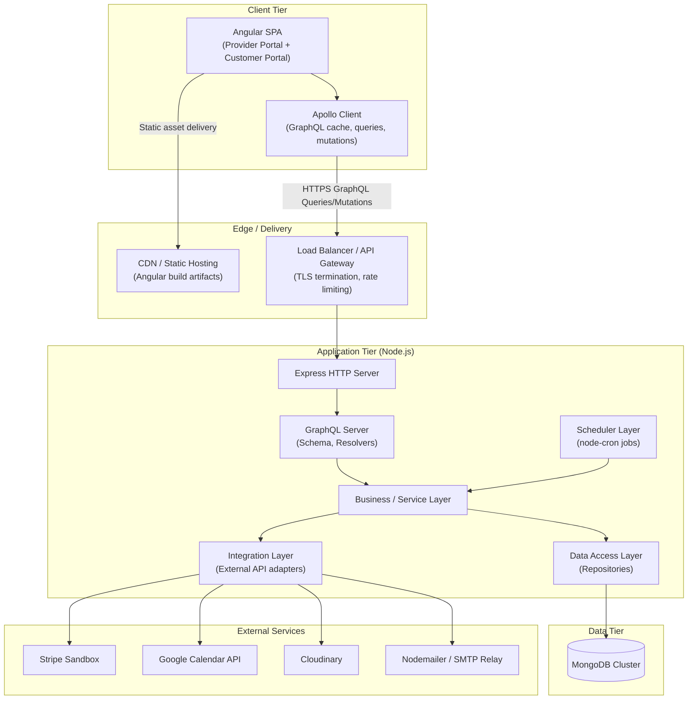
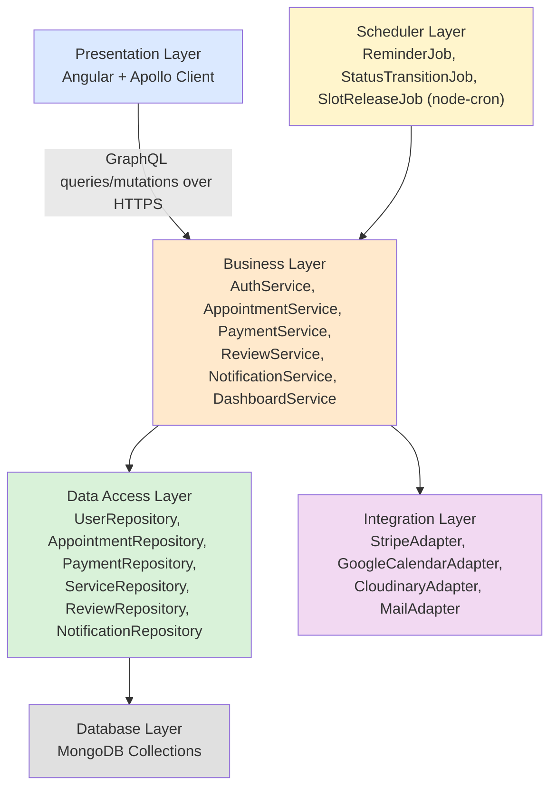
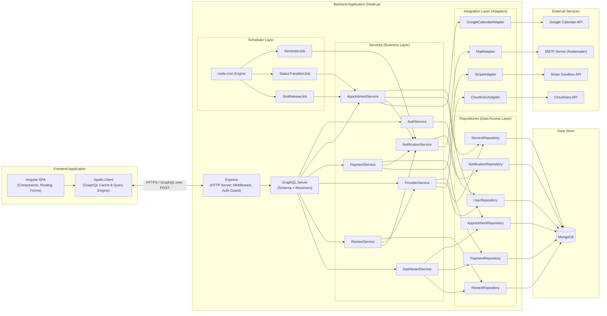
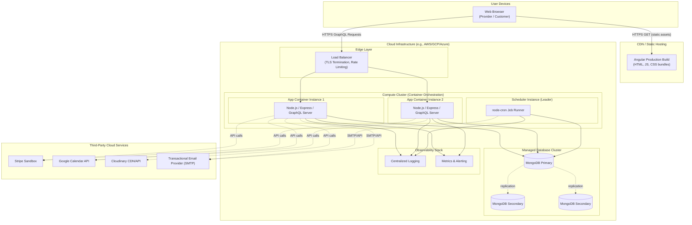

# Software Architecture Document

**Project:** Bookify – Smart Appointment & Business Management Platform
**Document Version:** 1.0
**Date:** June 30, 2026
**Based On:** Bookify SRS v1.0, Software Analysis v1.0, System Design v1.0, Sequence Diagrams v1.0
**Prepared By:** Senior Solution Architecture Team

---

## 1. High-Level Architecture

Bookify is architected as a **single-page application (SPA) front end backed by a unified GraphQL API gateway**, following a layered, modular-monolith approach for Release 1.0. A modular monolith is chosen over microservices because: the SRS mandates a fixed, cohesive stack (Node.js, Express, GraphQL, MongoDB); the domain is tightly coupled around a single core transaction (the appointment lifecycle); and team/operational overhead for distributed systems is not justified at this stage. The internal layering is nonetheless strict, so that individual domains (appointments, payments, notifications) could be extracted into independent services in a future phase without a full rewrite.

### 1.1 Architecture Style

- **Client:** Angular SPA communicating exclusively through a single GraphQL endpoint (Apollo Client).
- **Server:** Node.js/Express host process exposing one GraphQL API (Apollo Server/GraphQL Yoga over Express), internally organized into Service, Repository, and Integration layers.
- **Persistence:** MongoDB, accessed exclusively through the Repository layer (no direct DB access from business logic).
- **Background Processing:** node-cron–driven Scheduler layer running in-process, responsible for reminders, status transitions, and slot-hold expiry.
- **External Integrations:** Stripe Sandbox, Google Calendar API, Cloudinary, and Nodemailer/SMTP, all accessed through a dedicated Integration layer that isolates third-party SDKs from core business logic.

### 1.2 High-Level Architecture Diagram

---

## 2. Layered Architecture

The backend is internally organized into six explicit layers, each with a single responsibility and a strict dependency direction (top to bottom only; no layer reaches "upward" or skips a layer).

### 2.1 Presentation Layer (Client-Side)

- **Technology:** Angular, Apollo Client.
- **Responsibility:** Renders the Provider and Customer portals, manages client-side routing, form validation, and local UI state, and issues GraphQL queries/mutations through Apollo Client's normalized cache.
- **Boundaries:** Contains no business logic beyond input validation/UX guards; all authoritative validation and business rules (e.g., BR-01–BR-10) are enforced server-side. Communicates with the backend exclusively via the single GraphQL endpoint — no direct REST or DB access.

### 2.2 Business Layer (Service Layer)

- **Technology:** Node.js (TypeScript recommended), plain service classes/modules invoked by GraphQL resolvers.
- **Responsibility:** Implements all domain logic and business rules: slot generation and locking (FR-16, FR-27), appointment lifecycle transitions (FR-28–FR-33), cancellation/refund policy evaluation (BR-03, BR-04), review eligibility (BR-05), rating recalculation, and dashboard aggregation.
- **Boundaries:** Has no awareness of HTTP/GraphQL transport details (resolvers are thin adapters that call into services) and no direct knowledge of MongoDB query syntax (delegates persistence to the Data Access Layer) or third-party SDKs (delegates to the Integration Layer). This isolation is what allows business rules to be unit-tested without a live database or network connection.

### 2.3 Data Access Layer (Repository Layer)

- **Technology:** Mongoose (or native MongoDB driver) repositories, one per collection (`UserRepository`, `AppointmentRepository`, `PaymentRepository`, etc.).
- **Responsibility:** Encapsulates all MongoDB query, aggregation, and index logic (including the atomic `findOneAndUpdate` slot-locking operation supporting NFR-08). Translates between MongoDB documents and domain model objects used by the Business Layer.
- **Boundaries:** Contains no business rules — only persistence concerns (queries, transactions, indexing). This isolation allows the underlying database technology or schema details to evolve without touching business logic.

### 2.4 Integration Layer

- **Technology:** Dedicated adapter modules per external system (`StripeAdapter`, `GoogleCalendarAdapter`, `CloudinaryAdapter`, `MailAdapter`).
- **Responsibility:** Wraps all third-party SDK calls (Stripe payment intents/refunds, Google OAuth/Calendar events, Cloudinary uploads, Nodemailer SMTP dispatch), normalizes their responses/errors into internal domain types, and implements retry/backoff policies (NFR-09).
- **Boundaries:** The Business Layer never imports a third-party SDK directly; it only calls Integration Layer interfaces (e.g., `PaymentGateway.createIntent()`), which keeps vendor-specific logic swappable and testable via mocks.

### 2.5 Scheduler Layer

- **Technology:** node-cron, running as in-process scheduled jobs within the same Node.js application (Release 1.0; horizontally scaled deployments use a single designated scheduler instance/leader to avoid duplicate job execution).
- **Responsibility:** Triggers the `ReminderJob` (FR-40), `StatusTransitionJob` (FR-33 — Confirmed → Completed), and `SlotReleaseJob` (FR-26 — expired `pending_payment` holds), each invoking the Business Layer exactly as a GraphQL resolver would, preserving a single source of business logic.
- **Boundaries:** Contains only scheduling/triggering logic (cron expressions, job locking, retry-on-failure) — no business rules are duplicated here; jobs are thin orchestrators that call into the Business Layer.

### 2.6 Database Layer

- **Technology:** MongoDB (managed cluster, e.g., MongoDB Atlas), as defined in the System Design document's nine collections.
- **Responsibility:** Durable, indexed storage of all domain data, including the compound index supporting atomic slot-locking and unique/partial indexes enforcing one-review-per-appointment (BR-05) and one-profile-per-user constraints.
- **Boundaries:** Accessed exclusively through the Data Access Layer; no other layer issues queries directly against MongoDB.

### 2.7 Layered Architecture Diagram

---

## 3. Component Diagram

---

## 4. Deployment Diagram

### 4.1 Deployment Notes

- **Horizontal scaling:** Multiple stateless `Node.js/Express/GraphQL` containers run behind the Load Balancer; JWT-based auth (NFR-04, NFR-05) keeps these instances stateless, allowing any instance to serve any request.
- **Scheduler isolation:** Exactly one designated instance runs the active `node-cron` job runner (leader election or a dedicated deployment) to prevent duplicate reminder emails or double status transitions, per NFR-09's idempotency requirement.
- **Database resilience:** MongoDB is deployed as a replica set (primary + secondaries) for availability (NFR-03) and read scaling; the application connects via the primary for writes and can route eligible read-only queries (e.g., dashboard aggregation) to secondaries.
- **TLS everywhere:** All external traffic terminates TLS at the Load Balancer; all outbound calls to Stripe, Google, Cloudinary, and the SMTP relay use TLS 1.2+ (NFR-04).
- **Containerization:** Each compute unit is a Docker container, satisfying the SRS's portability constraint (NFR-14) and enabling consistent deployment across environments (dev/staging/production).

---

## 5. Data Flow Between Layers

This section traces how a request moves through the architecture end-to-end, using the **Book Appointment + Payment** flow as the representative example, then generalizes the pattern.

### 5.1 Request Path (Client → Database)

1. **Presentation Layer:** The Angular component captures user input (selected Service, slot) and Apollo Client sends a single GraphQL mutation (`requestBooking`) over HTTPS to the API Gateway/Load Balancer. Apollo's normalized cache is updated optimistically or upon response, but no business decision is made client-side.
2. **Edge:** The Load Balancer terminates TLS, applies rate limiting, and forwards the request to an available Express container instance.
3. **Express / GraphQL Server:** Express middleware authenticates the JWT and attaches the authenticated user context; the GraphQL Server parses the mutation, validates it against the schema, and invokes the corresponding resolver.
4. **Business Layer:** The resolver delegates immediately to `AppointmentService.reserveSlot()`. This is where all domain rules are enforced: working-hours validation, lead-time/advance-window checks (FR-18), and slot-conflict logic.
5. **Data Access Layer:** `AppointmentService` calls `AppointmentRepository.atomicReserve()`, which issues a single atomic MongoDB `findOneAndUpdate` against the compound slot index, guaranteeing no two concurrent requests can reserve the same slot (NFR-08).
6. **Database Layer:** MongoDB executes the atomic write and returns the result (success or conflict) back up through the Repository.
7. **Response Path:** The result propagates back: Repository → Service → Resolver → GraphQL Server → Express → Load Balancer → Apollo Client → Angular UI, which renders either the payment step or a "slot unavailable" message.

### 5.2 Integration Layer Data Flow (Payment Example)

1. Once the Customer is on the payment step, Apollo Client sends `initiatePayment` to the same GraphQL endpoint.
2. `PaymentService` (Business Layer) calls `StripeAdapter.createPaymentIntent()` (Integration Layer) rather than calling the Stripe SDK directly — this keeps Stripe-specific request/response shapes out of the business logic.
3. `StripeAdapter` communicates with Stripe Sandbox over HTTPS, normalizes the response into an internal `PaymentIntentResult` type, and returns it to `PaymentService`.
4. `PaymentService` persists the transaction via `PaymentRepository` (Data Access Layer) and, on confirmed success, updates the appointment status via `AppointmentRepository`.
5. `PaymentService` then asynchronously triggers `NotificationService`, which writes a `notifications` record (Data Access Layer) and calls `MailAdapter.sendEmail()` (Integration Layer), which dispatches via the SMTP relay (Nodemailer) — this leg is fire-and-forget relative to the Customer's response, so a slow email provider never blocks the payment confirmation response.

### 5.3 Scheduler Layer Data Flow

1. The `node-cron` Engine (Scheduler Layer) triggers `ReminderJob` on its configured interval, entirely independent of any client request.
2. `ReminderJob` calls directly into the **Business Layer** (`AppointmentService`/`NotificationService`) — never into the Data Access or Integration layers directly — preserving the rule that all business logic lives in exactly one place regardless of whether it's triggered by a user action or a timer.
3. From that point, the data flow is identical to a normal request: Business Layer → Data Access Layer (query due appointments, log notification) → Integration Layer (`MailAdapter` → SMTP) → Database Layer (status updates).

### 5.4 Cross-Cutting Flow Principles

- **Single direction of dependency:** Each layer only calls the layer immediately "below" it (Presentation → Business → Data Access/Integration → Database). No layer reaches backward or skips a layer, which keeps the system testable and prevents tangled coupling.
- **GraphQL as the sole client-facing contract:** Both the Provider and Customer portals, and all client state, flow through one GraphQL schema — there is no parallel REST surface for core domain operations, consistent with the SRS constraint in Section 5.5.
- **Synchronous vs. asynchronous flow:** Core transactional writes (slot reservation, payment confirmation) are synchronous and block the client response until durably persisted; secondary effects (emails, calendar sync) are dispatched asynchronously/fire-and-forget so they never delay or fail the primary user-facing transaction, while still being logged (via the `notifications` collection) for retry and auditability (NFR-09, NFR-13).
- **Idempotency at the boundaries:** Both Scheduler-triggered jobs and Integration Layer adapters are designed to be idempotent (e.g., reminder jobs check `reminderSent` flags before dispatch; calendar sync checks for an existing `googleCalendarEventId` before creating a duplicate event), ensuring safe retries after container restarts or transient failures.

---

*End of Document*
