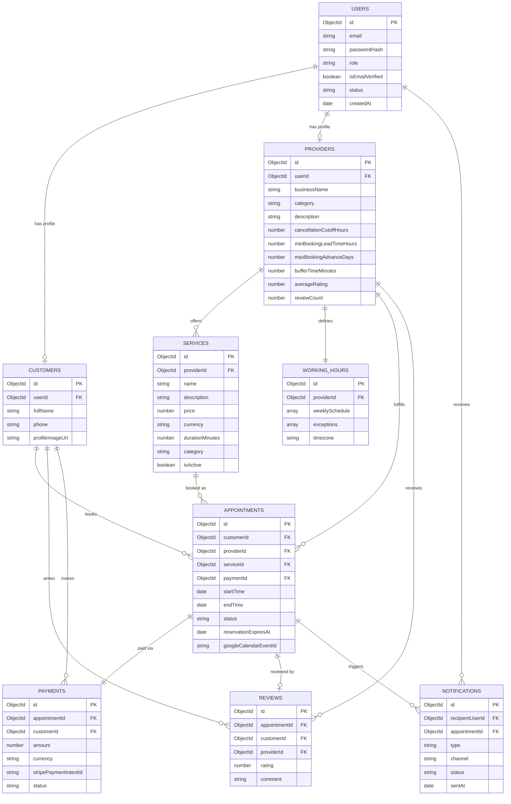
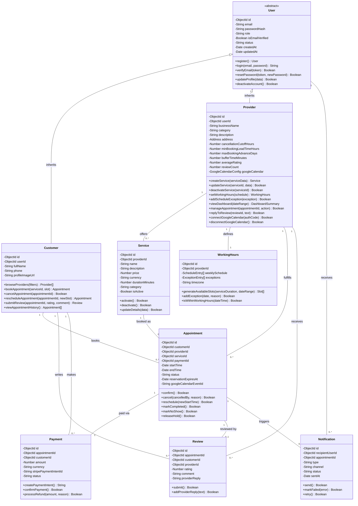

# System Design Documentation

**Project:** Bookify – Smart Appointment & Business Management Platform
**Document Version:** 1.0
**Date:** June 30, 2026
**Based On:** Bookify SRS v1.0, Bookify Software Analysis v1.0
**Prepared By:** Software Architecture & Business Analysis Team

---

## 1. Database Design

Bookify uses **MongoDB**, a document-oriented database, as mandated by the SRS (Section 5.5). The design favors a hybrid approach: closely related, bounded sub-data is embedded (e.g., recurring weekly hours within `WorkingHours`), while entities that grow independently, are queried independently, or are referenced from multiple places are stored as separate collections and linked via `ObjectId` references. This balances MongoDB's document model with the relational integrity needs implied by the SRS's business rules (e.g., BR-01–BR-10).

### 1.1 Collection: `users`

The base authentication/identity collection. `customers` and `providers` reference this collection via `userId` rather than using MongoDB discriminator embedding, to keep authentication concerns separate from role-specific profile data (supporting FR-01–FR-08).

| Field | Data Type | Description |
|---|---|---|
| `_id` | ObjectId | Primary key |
| `email` | String | Unique, indexed; used for login |
| `passwordHash` | String | Bcrypt-hashed password (NFR-05) |
| `role` | String (enum: `provider`, `customer`) | Determines role-based access (FR-08) |
| `isEmailVerified` | Boolean | Set true after email confirmation (FR-03) |
| `emailVerificationToken` | String | Time-limited token, nullable |
| `passwordResetToken` | String | Time-limited token, nullable (FR-05) |
| `passwordResetExpiresAt` | Date | Nullable |
| `status` | String (enum: `active`, `deactivated`) | Account status (FR-07) |
| `createdAt` | Date | Record creation timestamp |
| `updatedAt` | Date | Last modification timestamp |

**Relationships:** One-to-one with `customers` (if `role = customer`) or `providers` (if `role = provider`).

---

### 1.2 Collection: `customers`

Role-specific profile data for Customer users (FR-06).

| Field | Data Type | Description |
|---|---|---|
| `_id` | ObjectId | Primary key |
| `userId` | ObjectId (ref: `users`) | One-to-one link to base account |
| `fullName` | String | Customer's display name |
| `phone` | String | Contact number |
| `profileImageUrl` | String | Cloudinary-hosted image URL (FR-06) |
| `createdAt` | Date | Record creation timestamp |
| `updatedAt` | Date | Last modification timestamp |

**Relationships:**
- One-to-one with `users`.
- One-to-many with `appointments` (as the booking Customer).
- One-to-many with `reviews` (as review author).

---

### 1.3 Collection: `providers`

Role-specific business profile data for Provider users (FR-09, FR-10).

| Field | Data Type | Description |
|---|---|---|
| `_id` | ObjectId | Primary key |
| `userId` | ObjectId (ref: `users`) | One-to-one link to base account |
| `businessName` | String | Display name of the business |
| `category` | String | e.g., "Dentist", "Photographer", "Lawyer" |
| `description` | String | Business description |
| `address` | Embedded Object `{ street, city, state, country, postalCode }` | Business location |
| `phone` | String | Contact number |
| `profileImageUrl` | String | Cloudinary-hosted logo/photo URL |
| `galleryImageUrls` | Array\<String\> | Additional Cloudinary photo URLs |
| `cancellationCutoffHours` | Number | Hours before appointment after which cancellation is non-refundable (BR-03) |
| `minBookingLeadTimeHours` | Number | Minimum advance booking notice (FR-18) |
| `maxBookingAdvanceDays` | Number | Maximum days ahead bookings are allowed (FR-18) |
| `bufferTimeMinutes` | Number | Buffer enforced between appointments (FR-19, BR-10) |
| `averageRating` | Number | Denormalized, recalculated on new review (FR-45) |
| `reviewCount` | Number | Denormalized count of reviews |
| `googleCalendar` | Embedded Object `{ isConnected, accessToken, refreshToken, tokenExpiresAt }` | OAuth state for FR-50–FR-52 |
| `createdAt` | Date | Record creation timestamp |
| `updatedAt` | Date | Last modification timestamp |

**Relationships:**
- One-to-one with `users`.
- One-to-many with `services`.
- One-to-many with `workingHours` (one document per Provider, see 1.4).
- One-to-many with `appointments` (as the servicing Provider).
- One-to-many with `reviews` (as the reviewed entity).

---

### 1.4 Collection: `workingHours`

Stores recurring availability and date-specific exceptions per Provider (FR-14, FR-15). Implemented as a single document per Provider with embedded sub-arrays, since this data is always read/written as a unit.

| Field | Data Type | Description |
|---|---|---|
| `_id` | ObjectId | Primary key |
| `providerId` | ObjectId (ref: `providers`) | Owning Provider (one-to-one) |
| `weeklySchedule` | Array of Embedded Objects `{ dayOfWeek (0-6), isWorking, startTime, endTime }` | Recurring weekly availability (FR-14) |
| `exceptions` | Array of Embedded Objects `{ date, isFullyUnavailable, startTime, endTime, reason }` | Date-specific overrides, e.g., holidays (FR-15) |
| `timezone` | String | IANA timezone identifier for the Provider |
| `createdAt` | Date | Record creation timestamp |
| `updatedAt` | Date | Last modification timestamp |

**Relationships:** One-to-one with `providers`.

---

### 1.5 Collection: `services`

Bookable offerings created by a Provider (FR-11, FR-12, FR-13).

| Field | Data Type | Description |
|---|---|---|
| `_id` | ObjectId | Primary key |
| `providerId` | ObjectId (ref: `providers`) | Owning Provider |
| `name` | String | Service name |
| `description` | String | Service description |
| `price` | Number (Decimal128 recommended) | Price in smallest currency unit or decimal |
| `currency` | String | ISO currency code (e.g., "USD") |
| `durationMinutes` | Number | Used for slot generation (FR-16) |
| `category` | String | Service category/tag |
| `imageUrl` | String | Optional Cloudinary image |
| `isActive` | Boolean | Soft-delete flag (FR-12, BR-07) |
| `createdAt` | Date | Record creation timestamp |
| `updatedAt` | Date | Last modification timestamp |

**Relationships:**
- Many-to-one with `providers`.
- One-to-many with `appointments`.

---

### 1.6 Collection: `appointments`

The central transactional entity representing a booking and its lifecycle (FR-23–FR-33, BR-01, BR-02, BR-06, BR-08).

| Field | Data Type | Description |
|---|---|---|
| `_id` | ObjectId | Primary key |
| `customerId` | ObjectId (ref: `customers`) | Booking Customer |
| `providerId` | ObjectId (ref: `providers`) | Servicing Provider |
| `serviceId` | ObjectId (ref: `services`) | Booked Service (price/duration snapshotted below) |
| `serviceSnapshot` | Embedded Object `{ name, price, currency, durationMinutes }` | Immutable copy of Service details at booking time |
| `startTime` | Date | Appointment start (UTC) |
| `endTime` | Date | Appointment end (derived from `serviceSnapshot.durationMinutes`) |
| `status` | String (enum: `pending_payment`, `confirmed`, `completed`, `cancelled_by_customer`, `cancelled_by_provider`, `no_show`) | Lifecycle state (FR-28) |
| `reservationExpiresAt` | Date | Hold expiry timestamp while `status = pending_payment` (FR-24, FR-26) |
| `paymentId` | ObjectId (ref: `payments`) | Linked payment transaction, nullable until paid |
| `cancellation` | Embedded Object `{ cancelledBy, cancelledAt, reason, refundIssued }` | Nullable; populated on cancellation (FR-29, FR-31) |
| `googleCalendarEventId` | String | External reference for calendar sync (FR-51), nullable |
| `createdAt` | Date | Record creation timestamp |
| `updatedAt` | Date | Last modification timestamp |

**Relationships:**
- Many-to-one with `customers`.
- Many-to-one with `providers`.
- Many-to-one with `services`.
- One-to-one with `payments`.
- One-to-one with `reviews` (optional; only after completion).
- One-to-many with `notifications`.

**Indexing Notes:** A compound unique/partial index on `{ providerId, startTime, endTime }` filtered to `status in [pending_payment, confirmed]` supports atomic slot-locking to satisfy FR-27/NFR-08.

---

### 1.7 Collection: `payments`

Transaction records for Stripe Sandbox payments and refunds (FR-34–FR-38).

| Field | Data Type | Description |
|---|---|---|
| `_id` | ObjectId | Primary key |
| `appointmentId` | ObjectId (ref: `appointments`) | Associated appointment |
| `customerId` | ObjectId (ref: `customers`) | Paying Customer |
| `amount` | Number (Decimal128) | Charged amount |
| `currency` | String | ISO currency code |
| `stripePaymentIntentId` | String | Stripe reference ID |
| `status` | String (enum: `pending`, `succeeded`, `failed`, `refunded`, `partially_refunded`) | Payment status |
| `refund` | Embedded Object `{ stripeRefundId, amount, reason, processedAt }` | Nullable; populated on refund (FR-36) |
| `createdAt` | Date | Record creation timestamp |
| `updatedAt` | Date | Last modification timestamp |

**Relationships:** One-to-one with `appointments`; many-to-one with `customers`.

---

### 1.8 Collection: `reviews`

Customer-submitted ratings and feedback (FR-43–FR-46, BR-05).

| Field | Data Type | Description |
|---|---|---|
| `_id` | ObjectId | Primary key |
| `appointmentId` | ObjectId (ref: `appointments`) | The Completed appointment this review is tied to (unique — enforces one review per appointment) |
| `customerId` | ObjectId (ref: `customers`) | Review author |
| `providerId` | ObjectId (ref: `providers`) | Reviewed Provider |
| `rating` | Number (1–5) | Star rating |
| `comment` | String | Optional written feedback |
| `providerReply` | Embedded Object `{ text, repliedAt }` | Nullable; single provider reply (FR-46) |
| `createdAt` | Date | Record creation timestamp |
| `updatedAt` | Date | Last modification timestamp |

**Relationships:**
- One-to-one with `appointments`.
- Many-to-one with `customers`.
- Many-to-one with `providers`.

---

### 1.9 Collection: `notifications`

Log of transactional notifications dispatched via Nodemailer and triggered by node-cron jobs (FR-39–FR-42).

| Field | Data Type | Description |
|---|---|---|
| `_id` | ObjectId | Primary key |
| `recipientUserId` | ObjectId (ref: `users`) | Notification recipient |
| `appointmentId` | ObjectId (ref: `appointments`) | Related appointment, nullable for non-appointment notifications |
| `type` | String (enum: `booking_confirmation`, `new_booking_alert`, `reminder`, `cancellation`, `reschedule`, `review_request`, `password_reset`, `email_verification`) | Notification category |
| `channel` | String (enum: `email`) | Delivery channel (extensible for future SMS support) |
| `status` | String (enum: `pending`, `sent`, `failed`) | Delivery status (NFR-09) |
| `sentAt` | Date | Nullable |
| `errorMessage` | String | Nullable; populated on delivery failure |
| `createdAt` | Date | Record creation timestamp |

**Relationships:** Many-to-one with `users`; many-to-one with `appointments` (optional).

---

### 1.10 Relationship Summary

| Relationship | Cardinality |
|---|---|
| User — Customer | 1:1 |
| User — Provider | 1:1 |
| Provider — Service | 1:N |
| Provider — WorkingHours | 1:1 |
| Customer — Appointment | 1:N |
| Provider — Appointment | 1:N |
| Service — Appointment | 1:N |
| Appointment — Payment | 1:1 |
| Appointment — Review | 1:1 (optional) |
| Customer — Review | 1:N |
| Provider — Review | 1:N |
| User — Notification | 1:N |
| Appointment — Notification | 1:N |

---

## 2. ER Diagram (Mermaid ER Syntax)

---

## 3. UML Class Diagram (Mermaid Syntax)

The class diagram models `Customer` and `Provider` as specializations of an abstract `User` base class (inheritance), reflecting the SRS's two-role model (Section 6) while sharing common authentication behavior.

### 3.1 Design Notes

- **Inheritance:** `Customer` and `Provider` both inherit from the abstract `User` class, reflecting shared authentication/account behavior defined in FR-01–FR-08, while encapsulating role-specific attributes and methods separately — consistent with the SRS's strict two-role model (no Admin class).
- **Multiplicity:** `Provider`-to-`Appointment` and `Customer`-to-`Appointment` are both one-to-many, while `Appointment`-to-`Payment` is enforced as one-to-one (an appointment cannot be confirmed without exactly one successful payment, per FR-25/BR-02). `Appointment`-to-`Review` is one-to-optional-one, reflecting that a review is only possible after completion (BR-05).
- **Encapsulation:** Methods such as `confirm()`, `cancel()`, and `reschedule()` on `Appointment` encapsulate the lifecycle transition rules defined in FR-28–FR-33 and the business rules in Section 10 of the SRS, rather than allowing direct external status mutation.
- **Consistency with database design:** Class attributes map directly to the MongoDB collection fields described in Section 1, with embedded value objects (e.g., `Address`, `ScheduleEntry`, `GoogleCalendarConfig`) represented as supporting structures rather than top-level classes.

---

*End of Document*
